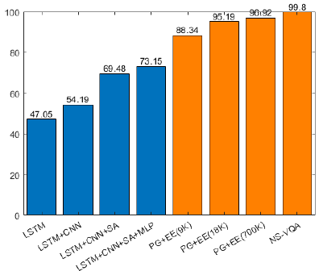
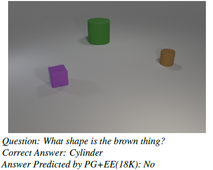
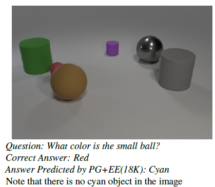

# Visual Question Answering

## 1. Introduction

For an overview of this project, please refer to my [presentation](FinalPresentation.pdf). For more technical details, please refer to the [report](CMPT_983_Final_Report.pdf).

### 1.1 Background and Motivation

Reasoning about everyday visual input is one of the most fundamental building blocks of human intelligence. `Visual Question Answering` (VQA) is a rapidly evolving field which witnesses many achievements, however, it is unclear if the models get good performance on certain datasets because of true reasoning abilities or just overfitting to biases in the datasets.

### 1.2 Tasks of the Project

In this project, my main work includes:

- Make performance comparison between `PG+EE` approach and `NS-VQA` approach.
- Analysis the failing cases for `PG+EE` approach.

**Topics:** _Visual Question Answering_, _Grounded Natural Language Processing_

**Skills:** _Pytorch_, _Python_, _Deep Neural Networks_

## 2. Results

Accuracy of different `VQA` models:

Most of mistakes that `PG+EE` made can be categorized into 2 types.

**Type I:** the answers are not relevant to the questions.

**Type II:** the answers include some objects/attributes that are not shown in the picture.

## 3. Acknowledgement

We acknowledge the use of codes from [PG+EE](https://github.com/facebookresearch/clevr-iep) and [NS-VQA](https://github.com/kexinyi/ns-vqa).
